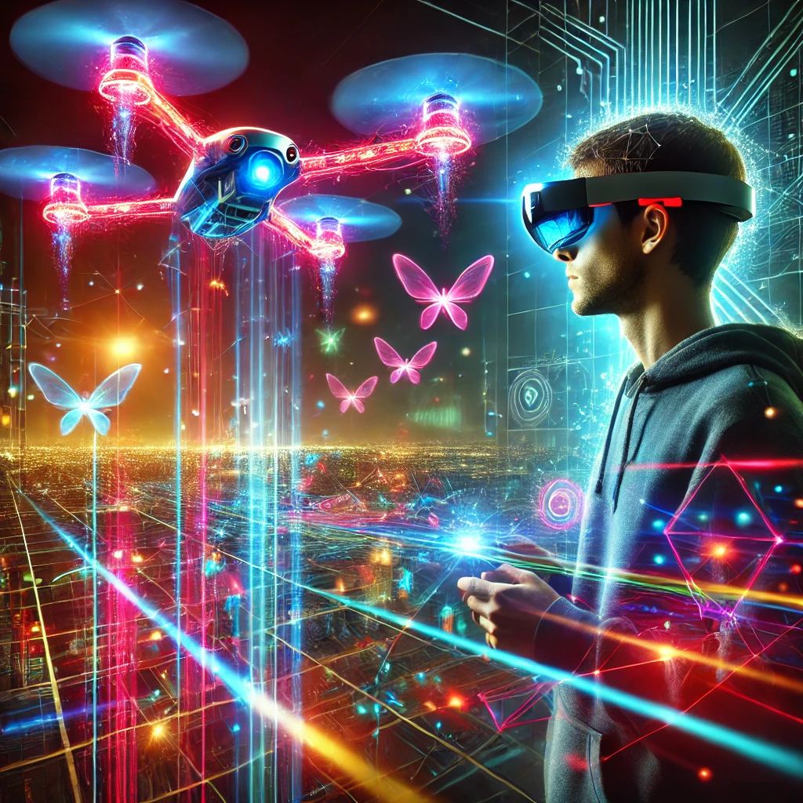
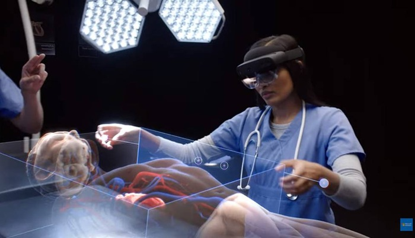
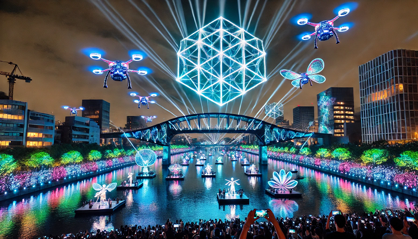

# Visionando el futuro con las gafas de Manovich
#### Universitat Oberta de Catalunya - Cultura digital - PEC03
#### Isaac Francín Daimiel
#### 20/12/2024

## Planteamiento

En este ensayo investigaré y realizaré un breve análisis sobre dos nuevos ejemplos de hibridación que podrían formar parte de una hipotética segunda versión del libro de **Manovich**, como tantos otros ejemplos que han sabido aprovechar conceptos tecnológicos ya existentes y reinventarse para ofrecer nuevas funcionalidades y potenciar aún más ese ámbito. 

El primer caso planteado será el visor de realidad mixta **HoloLens 2 de Microsoft**.

El segundo caso planteado será el modelo de drones **Intel Shooting Star**.
hando conceptos tecnológicos anteriores, si no que en su propia evolución se han adaptado y re-descubierto nuevas utilidades y funciones que aún hacen de estos dos elementos dos casos muy interesantes.

En ambos casos se plantearán y comentarán aquellas características  principales que hacen de estos dos casos escogidos perfectos ejemplos de **hibridación moderna**, veremos como no solamente se han reinventado  aprovechando conceptos tecnológicos anteriores, sino que en su propia evolución se han adaptado y redescubierto nuevas utilidades y funciones que aún hacen de estos dos elementos dos casos muy interesantes.

## Re-descubriendo la hibridación: Microsoft HoloLens 2

Las **HoloLens 2** son un dispositivo de realidad mixta desarrollado por el gigante **Microsoft**. Con estas gafas se puede combinar la realidad virtual (VR) y la realidad augmentada (AR), por lo que tenemos un amplio abanico de posibilidades para enfocar esta tecnología, ya sea a nivel de entretenimiento, investigación o exploración.

Con estas gafas de realidad mixta, que fusionará las virtudes de diferentes medios audiovisuales, podremos tener una inmersión en primera persona en distintas experiencias. Estas experiencias como he comentado anteriormente se pueden centrar simplemente en el entretenimiento del usuario, como por ejemplo los videojuegos, o llevarlo un escalón más allá y utilizarlo para la investigación y/o prácticas clínicas, fomentando así su uso a nivel educativo, laboral y profesional.

En el ámbito que me centraré yo será el sanitario. Con la ejecución de diferentes aplicaciones compatibles con el software de estas gafas podremos ejecutar, recrear e interaccionar con diferentes entornos médicos y poner en práctica o perfeccionar diferentes habilidades y procedimientos de cirugías asistidas en modelos 3D superpuestos en tiempo real, haciendo uso de la realidad augmentada entre otras.

Las posibilidades en este campo son infinitas, la integración y fusión de diferentes tecnologías audiovisuales lo hacen todavía mucho más funcional, más allá de la realidad mixta que ya de por si nos ofrece este dispositivo, la hibridación hace posible una serie de características y funcionalidades, comentaré algunas de ellas:

1. **Gesticulación**: Gracias a los sensores de profundidad y seguimiento de las manos podremos interactuar mediante movimientos con nuestras propias manos sobre los hologramas sin necesidad de dispositivos, de esta forma la inmersión será mucho mas profunda. 
2. **Control ocular**: Aprovechando el seguimiento ocular de este dispositivo el usuario o profesional de la salud en este caso, podrá interactuar con la interfaz y controlar las diferentes opciones disponibles a través de la mirada, sin necesidad de tener que interactuar con las manos. Esta opción seria clave en entornos quirúrgicos o situaciones sanitarias donde por ejemplo el profesional deba mantener ambas manos estériles por un tema de seguridad e higiene.
3. **Control por voz**: El control por voz será de gran ayuda tanto para la elección de diferentes opciones, navegar por los distintos menús del entorno virtual, así como el control de objetos holográficos sin necesidad de utilizar las manos o controles adicionales que entorpezcan la experiencia o el aprendizaje, ya que en muchos entornos sanitarios, como por ejemplo una cirujía, tendremos las manos totalmente ocupadas.
4. **Trabajo en equipo**: Uno de los puntos destacables de la hibridación seria la posibilidad de trabajar en equipo, cooperar o colaborar en un mismo entorno digital por varias personas a la vez, independientemente de la ubicación de cada una de ellas. Poder trabajar en tiempo real sobre un modelo 3D supone un gran avance tecnológico, facilitando así el trabajo a distancia de diferentes profesionales de la sanidad. Concretamente la aplicación **Microsoft Mesh** permite a los usuarios de **HoloLens 2** poder realizar esta tarea.
5. **Escaneo del entorno**: El escaneo del entorno en tiempo real da paso a otra serie de características clave, ya que esto nos permitirá integrar modelos holográficos de una forma totalmente fiel a nuestro mundo real, en este caso hospitales, clínicas, consultas, etc.
6. **Modelado 3D**: En un entorno médico donde poder practicar ciertas habilidades sanitarias se hace muy complicado por lo obvio, será de gran ayuda tener modelos tridimensionales para poder recrear desde operaciones médicas comunes hasta las más avanzadas. El hecho de poder manipular, girar, explorar sin ningún tipo de riesgo para el paciente y en un entorno totalmente seguro para el profesional hace de esta una opción muy interesante para este campo, ya que podremos simular cualquier situación médica.

### Conclusiones

La hibridación ha permitido con este dispositivo aprovechar diversos medios audiovisuales o tecnologías ya creadas anteriormente, darles otra vuelta de rosca, y potenciarlas para nuevos usos. Pudiendo así realizar simulaciones médicas en realidad mixta muy fieles a la realidad para avanzar notablemente en el campo sanitario, concretamente con las cirugías que son un escenario muy delicado, muchas técnicas avanzadas son complicadas de recrear de forma artificial, y con este dispositivo podemos realizarlas en un entorno seguro, con muchas ventajas téncnicas y cooperación de otros profesionales de la salud en tiempo real.

### Enlaces de interés
1. [https://news.microsoft.com/es-xl/features/el-proyecto-hololens-permite-colaborar-a-cirujanos-de-todo-el-mundo/](https://news.microsoft.com/es-xl/features/el-proyecto-hololens-permite-colaborar-a-cirujanos-de-todo-el-mundo/)

2. [https://es.gizmodo.com/asi-estan-empezando-a-usarse-las-hololens-de-microsoft-1819797492](https://es.gizmodo.com/asi-estan-empezando-a-usarse-las-hololens-de-microsoft-1819797492)

3. [https://www.inoutviajes.com/noticia/14966/otras-noticias/hololens-2-el-dispositivo-que-abre-la-puerta-a-la-cirugia-en-remoto-a-nivel-mundial.html](https://www.inoutviajes.com/noticia/14966/otras-noticias/hololens-2-el-dispositivo-que-abre-la-puerta-a-la-cirugia-en-remoto-a-nivel-mundial.html)

## Re-descubriendo la hibridación: Intel Shooting Star

Los drones empezaron a utilizarse a partir de la década del 2000. Su  utilización no era tan a nivel personal como en la actualida, sino que se empezaron a utilizar para realizar fotografía aérea para reconocimientos del lugar, mapear grandes zonas, en la agricultura de precisión, como sistema de vigilancia, etc.

Su constante evolución, tanto en características técnicas como en usos comerciales o personales ha hecho que su  utilización también explore nuevos campos en los que en un principio no  estaban pensados para su uso, uno de ellos son los espectáculos de luces en el aire, utilizando cientos de luces LED programables.

Los espectáculos de luces LED con drones es una forma innovadora de iluminar el cielo con distintas formas o dibujos, realizar una coreografía, incluso proyectar una pequeña historia. Estos drones permiten una hibridación de la tecnología y el arte visual.

No todos los drones sirven para este fin, la línea de drones **Intel Shooting Star** están pensados especialmente para realizar espectáculos de luces, su fuente  de luz tiene la capacidad de crear más de 4000 millones de combinaciones de colores, pudiendo desplazarse incluso al ritmo de una canción. No  necesitan de un sistema de GPS, ni de ser controlados individualmente  por un piloto, de hecho un solo piloto podría llegar a controlar hasta  100 drones a la vez, se programan con un sistema especial, se sueltan en el aire y cada dron ya tiene programada toda su rutina, obteniendo una  sincronización espectacular entre todos ellos.

Los elementos clave que hacen posible esta hibridación son los siguientes:

1. **Luces LED programables:** Este modelo de dron tiene la capacidad de crear más de 4000 millones de  combinaciones de colores, por lo que tiene una flexibilidad casi  ilimitada en cuanto a colores, intensidad y patrones para recrear las  figuras, formas o efectos deseados. Con este gran margen podremos  recrear desde espectáculos más básicos a espectáculos complejos que  integren música, sonidos, movimiento, efectos o algún tipo de narración concreta.
2. **Control y posicionamiento avanzado:** El control centralizado que proporcionan estos drones, junto con un  posicionamiento avanzado nos proporciona una sincronización excelente,  junto con un sistema de algoritmos con el que podremos proyectar figuras históricas, logotipos de empresas o marcas, banderas de países o representar temas culturales, históricos o de un interés concreto para un evento en cuestión.
3. **Utilización:** El uso de estos drones puede ser muy diverso, ya que en función de las necesidades de la empresa, institución o asociación contratante puede estar orientado a un fin u otro, como por ejemplo:
   - Publicidad y marketing  (campañas publicitarias, logos empresas...)
   - Causas sociales (datos científicos, patrones de contaminación, biodiversidad en peligro, cambio climático...)
   - Espectáculos (conciertos, teatros, juegos olímpicos, eventos deportivos, conmemoraciones históricas...)
   - Cinematográfico (documentales, programas de televisión, cine...)
   - Turismo y ocio (bodas, cumpleaños, espectáculos en puntos turísticos, parques de atracciones, zonas naturales...)

### **Conclusiones**

La hibridación ha permitido en los drones aprovechar sus caracteristicas principales y fusionarlas con otra serie de características  tecnológicas permitiendo así su exploración en otros terrenos y potenciando el uso de estos. Esto a su vez a permitido una mayor comercialización, abaratando el coste de productividad y pudiendo ser mucho más accesible incluso a nivel particular. Aún hay muchos inconvenientes y desafios en el camino, como por ejemplo lidiar con las condiciones climáticas adversas (viento fuerte, lluvia...), duración limitada de la batería, integración de la IA en los drones, reducir la contaminación acústica, etc...

### **Enlaces de interés**

1. [https://www.xataka.com/drones/mas-de-1200-drones-volando-al-mismo-tiempo-el-video-del-espectaculo-de-luces-de-los-juegos-olimpicos-de-invierno](https://www.xataka.com/drones/mas-de-1200-drones-volando-al-mismo-tiempo-el-video-del-espectaculo-de-luces-de-los-juegos-olimpicos-de-invierno)

2. [https://hacedores.com/drones-shooting-stars/](https://hacedores.com/drones-shooting-stars/)

3. [https://www.digitalavmagazine.com/2016/11/08/con-el-dron-shooting-star-intel-crea-coreografias-de-luces-en-el-cielo-nocturno/](https://www.digitalavmagazine.com/2016/11/08/con-el-dron-shooting-star-intel-crea-coreografias-de-luces-en-el-cielo-nocturno/)

**Vídeo de muestra**: [https://www.youtube.com/watch?v=A4afTwJABkk](https://www.youtube.com/watch?v=A4afTwJABkk)

## **Bibliografía**

Manovich, Lev. (2013). El Software toma el mando. [en línea] [fecha de consulta: 2 de diciembre de 2024]. Disponible en: 

[https://aula.uoc.edu/courses/43275/pages/recursos-de-aprendizaje-pec3?module_item_id=1754887](https://aula.uoc.edu/courses/43275/pages/recursos-de-aprendizaje-pec3?module_item_id=1754887)

UOC (Recursos de aprendizaje) [en línea] [fecha de consulta: 2 de diciembre de 2024]. Disponible en: 

[https://aula.uoc.edu/courses/43275/pages/recursos-de-aprendizaje-pec3?module_item_id=1754887](https://aula.uoc.edu/courses/43275/pages/recursos-de-aprendizaje-pec3?module_item_id=1754887)

Typora [en línea] [fecha de consulta: 3 de diciembre de 2024]. Disponible en: 

[https://typora.io/](https://typora.io/)

ChatGPT (Imágenes) [en línea] [fecha de consulta: 6 de diciembre de 2024]. Disponible en: 

[https://chatgpt.com/](https://chatgpt.com/)

AS (Imágen) [en línea] [fecha de consulta: 6 de diciembre de 2024]. Disponible en: 

[https://as.com/deporteyvida/2019/02/25/portada/1551089734_319923.html](https://as.com/deporteyvida/2019/02/25/portada/1551089734_319923.html)

Microsoft (información) [en línea] [fecha de consulta: 10 de diciembre de 2024]. Disponible en: 

[https://news.microsoft.com/es-xl/features/el-proyecto-hololens-permite-colaborar-a-cirujanos-de-todo-el-mundo/](https://news.microsoft.com/es-xl/features/el-proyecto-hololens-permite-colaborar-a-cirujanos-de-todo-el-mundo/)

Gizmodo (información) [en línea] [fecha de consulta: 10 de diciembre de 2024]. Disponible en: 

[https://es.gizmodo.com/asi-estan-empezando-a-usarse-las-hololens-de-microsoft-1819797492](https://es.gizmodo.com/asi-estan-empezando-a-usarse-las-hololens-de-microsoft-1819797492)

Inoutviajes (información) [en línea] [fecha de consulta: 10 de diciembre de 2024]. Disponible en: 

[https://www.inoutviajes.com/noticia/14966/otras-noticias/hololens-2-el-dispositivo-que-abre-la-puerta-a-la-cirugia-en-remoto-a-nivel-mundial.html](https://www.inoutviajes.com/noticia/14966/otras-noticias/hololens-2-el-dispositivo-que-abre-la-puerta-a-la-cirugia-en-remoto-a-nivel-mundial.html)

Xataka (información) [en línea] [fecha de consulta: 14 de diciembre de 2024]. Disponible en: 

[https://www.xataka.com/drones/mas-de-1200-drones-volando-al-mismo-tiempo-el-video-del-espectaculo-de-luces-de-los-juegos-olimpicos-de-invierno](https://www.xataka.com/drones/mas-de-1200-drones-volando-al-mismo-tiempo-el-video-del-espectaculo-de-luces-de-los-juegos-olimpicos-de-invierno)

Hacedores (información) [en línea] [fecha de consulta: 14 de diciembre de 2024]. Disponible en: 

[https://hacedores.com/drones-shooting-stars/](https://hacedores.com/drones-shooting-stars/)

Digitalavmagazine (información) [en línea] [fecha de consulta: 14 de diciembre de 2024]. Disponible en: 

[https://www.digitalavmagazine.com/2016/11/08/con-el-dron-shooting-star-intel-crea-coreografias-de-luces-en-el-cielo-nocturno/](https://www.digitalavmagazine.com/2016/11/08/con-el-dron-shooting-star-intel-crea-coreografias-de-luces-en-el-cielo-nocturno/)

Youtube (vídeo) [en línea] [fecha de consulta: 14 de diciembre de 2024]. Disponible en: 

[https://www.youtube.com/watch?v=A4afTwJABkk](https://www.youtube.com/watch?v=A4afTwJABkk)

